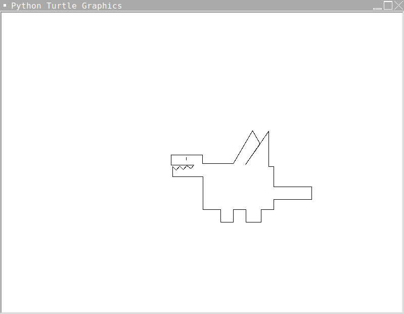
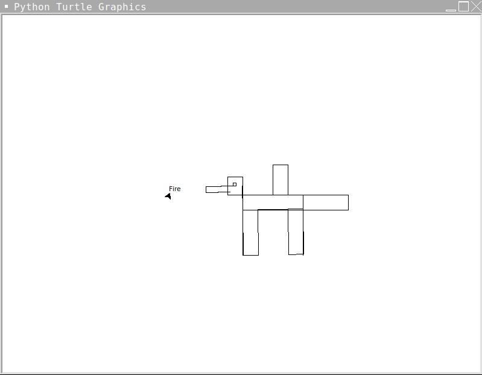
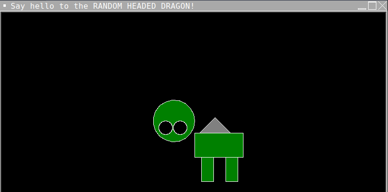

# Turtle Python Project - How to Train Your Turtle

 You've learned about objects, methods, arguments, variables, and more!
With this knowledge, you can start to use other's python code to make your own programs.

## The "Turtle" Library
#### We'll be using a library called "turtle" to make a cool drawing.
#### Since turtle uses a special library that lets us draw on a screen, we need to use a different development environment (IDE).
#### Luckily, Python is the same regardless of the development environment you use, so it should be easy to switch, everything you just learned is still useful.

## Documentation
#### Before you head off to train your turtle, let's look at some basic commands and find the "documentation" for the turtle library.

#### Copy and paste the link below into your browser to find the documentation for the turtle library.
### https://docs.python.org/3/library/turtle.html

#### Documentation is AMAZING. We love documentation. Documentation is the best way to learn about a library.
#### Good developers write clear documentation that explains how to use the library that they wrote. 
#### Not all libraries have good documentation... so sometimes you'll be stuck looking through the code to figure out how to use it. Not this time, though!

#### The turtle library is a special library that was first created by Wally Feurzeig, Seymour Papert and Cynthia Solomon in 1967, before Python was even a thing.
#### Eventually the library was rewritten in Python so we can use it today to draw using code.
#### The turtle is just a triangle that draws, but you can make it draw for you by moving it around the screen with your code.

## Commands
#### The library is pretty simple - you'll need to know a few commands to get started.
- `turtle.forward(distance)` - Moves the turtle forward by the specified distance.
- `turtle.right(angle)` - Turns the turtle right by the specified angle. Use 90 degree angles to make things simple!
- `turtle.left(angle)` - Turns the turtle left by the specified angle. Use 90 degree angles to make things simple!
- `turtle.penup()` - Picks up the pen, so the turtle doesn't draw.
- `turtle.pendown()` - Puts down the pen, so the turtle can draw.

## Requirements/Rubric
#### Your job is to use these commands to draw a MAJESTIC DRAGON!
#### Here are the requirements for a green dragon:
- The dragon should have a head and body.
- The dragon should have a tail.
- The dragon should have wings.
- The dragon should have at least one eye.
- Create and reference at least one variable.

#### To get a blue on this project, you'll need to do the following on top of all of the requirements for a green:
- Your dragon needs to be a color other than black. You can find the color commands in the documentation.
- At least one part of your dragon needs to be a circle. You can find the circle command in the documentation.

#### Remember, your dragon is supposed to look a little silly. Don't worry about making it look perfect, you are being graded on your ability to use the commands and dig through the documentation.
#### That being said... whoever wins the vote for the best dragon will get a pretty sick prize!

## Examples:
#### Previous Competition Winner:

#### Example Green Dragon:

#### Example Blue Dragon:

